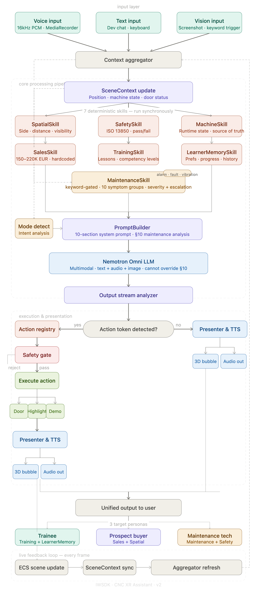

# Lathe Trainer

An immersive XR training prototype for learning CNC lathe operation with a spatial AI assistant. The app runs in WebXR, places a CNC machine and robot companion in a 3D scene, and lets users ask questions, receive voice responses, trigger guided demonstrations, highlight machine components, and practice safety-aware workflows.

The project is built with IWSDK, Three.js, Vite, TypeScript, UIKitML, and a deterministic skill layer that prepares reliable machine, safety, spatial, sales, training, learner-memory, and maintenance facts before each AI request.

## Features

- WebXR CNC lathe training scene with GLB machine and robot assets
- Spatial AI assistant that understands user position, visible components, and live machine state
- Multilingual assistant behavior for English, Italian, and Arabic
- Voice input through `MediaRecorder`, including 16kHz resampling for AI audio requests
- Text-to-speech output with Riva support and browser speech fallback
- Robot companion with visual states for idle, listening, thinking, and speaking
- Action token system for safe machine actions such as opening/closing the door and highlighting components
- Deterministic safety checks for door/spindle behavior and operator reach
- Maintenance troubleshooting skill for alarms, faults, vibration, leaks, overheating, power loss, and related symptoms
- Developer chat overlay for browser testing without a headset
- PWA Web Share Target support for sending system screenshots into the app for vision workflows

## Tech Stack

- XR framework: `@iwsdk/core`
- Rendering: Three.js via `super-three`
- UI: UIKitML compiled to `public/ui/*.json`
- Build: Vite 7 and TypeScript
- PWA: `vite-plugin-pwa`
- Package manager: pnpm
- AI model path: Nvidia-compatible chat/audio/vision endpoint

## Project Structure

```text
src/
  index.ts                    Main XR scene bootstrap
  services/                   AI, prompt, scene, action, screenshot services
  systems/                    ECS systems for assistant, robot, input, doors, hotspots
  skills/                     Deterministic skill layer used before LLM calls
  machine/                    Machine component map and demos
  robot/                      Robot presenter and output channels
  overlay/                    Browser developer assistant overlay
  sw.ts                       PWA share-target service worker

ui/                           UIKitML source files
public/
  gltf/                       3D machine and robot assets
  textures/                   HDR and texture assets
  ui/                         Generated UI JSON files
  CNC_Knowledge.md            Runtime CNC knowledge base
```

## Requirements

- Node.js `>=20.19.0`
- pnpm
- A modern browser with WebXR support
- Meta Quest Browser for headset testing

## Setup

```bash
pnpm install
```

Create a local `.env` file for development:

```bash
VITE_AI_API_KEY=your_api_key_here
```

Do not commit `.env` or publish builds that expose private API keys.

## Development

```bash
pnpm dev
```

The Vite dev server is configured for host `0.0.0.0` on port `8081`, which makes it easier to test from a headset on the same network.

## Build

```bash
pnpm build
```

The build compiles UIKitML files, bundles the XR app, emits the PWA manifest, and builds the custom service worker.

Preview the production build:

```bash
pnpm preview
```

## AI Architecture



The assistant does not rely only on raw prompt text. Before each request, deterministic TypeScript skills compute structured facts:

- Spatial facts: user side, nearest component, distance, visible components
- Safety facts: safe/unsafe operation checks and refusal conditions
- Machine facts: current door, spindle, mode, and selected component state
- Sales facts: fixed commercial values to avoid financial hallucination
- Training facts: lesson progress and competency state
- Learner memory: language preference, skill level, lessons, mistakes, safety score
- Maintenance facts: symptom analysis, severity, escalation, probable causes, and recommended actions

The LLM receives those facts as prompt context and explains them conversationally, but deterministic outputs such as safety and maintenance status are treated as authoritative.

## PWA Screenshot Flow

The app includes a Web Share Target workflow for Quest screenshots:

1. Install the app as a PWA from Meta Quest Browser.
2. Take a native Quest screenshot.
3. Share the image to “Lathe Trainer”.
4. The service worker receives the image and forwards it to the running app.
5. The assistant can use the image with the current scene context for vision-style questions.

## Publish Notes

Before public deployment:

- Rotate any API keys that were exposed during local testing.
- Move AI requests behind a server-side proxy instead of shipping keys to the browser.
- Run a clean `pnpm install` and `pnpm build`.
- Check the generated `dist/ai-assistant/env.js`; it must not contain a private production key.
- Consider code-splitting if startup performance becomes an issue on Quest, because the main bundle can be large.

## Documentation

- [SUMMERY.md](./SUMMERY.md) contains the full internal architecture summary and roadmap.
- [CNC_Knowledge.md](./public/CNC_Knowledge.md) is the runtime machine knowledge base.
- [ASSISTANT_ARCHITECTURE.md](./ASSISTANT_ARCHITECTURE.md) describes the assistant design in more detail.
