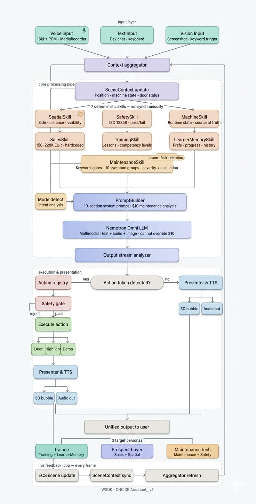

# Lathe Trainer

> Democratizing Industrial AI through Mixed Reality, Deterministic Intelligence, and Real-Time Knowledge Transfer.

**Live Demo:** [lathe-trainer.netlify.app](https://lathe-trainer.netlify.app/)

---

# Tech Stack

## Runtime & Rendering
- **Three.js** — 3D scene rendering and spatial environment
- **TypeScript** — fully typed codebase from AI pipeline to ECS systems
- **WebXR** — immersive XR session management and headset integration
- **Vite** — development server and production build

## XR Platform
- **Meta Quest 3** — primary target headset (WebXR-compatible)
- **IWSDK (Immersive Web SDK)** — ECS-based XR application framework built on Three.js
- **UIKitML / uikitml** — declarative XML-based XR UI panel system

## 3D & Assets
- **Blender** — 3D model authoring and rigging
- **GLTF / GLB** — runtime 3D asset format
- **HDR environment maps** — physically-based lighting

## AI & Backend
- **NVIDIA Nemotron 3 Nano Omni 30B** — multimodal foundation model (text, vision, audio)
- **NVIDIA NIM API** — inference endpoint
- **Web Speech Synthesis API** — native TTS for XR audio output
- **MediaRecorder API** — voice input capture

## Testing & Quality
- **Vitest** — unit test runner (86 tests)
- **jsdom** — DOM environment for test isolation

## CI/CD
- **GitHub Actions** — automated install, test, build, and security audit on every push
- **Dependabot** — weekly automated dependency update PRs

---

# Executive Summary

Lathe Trainer is not simply an XR application.

It is an Industrial AI architecture designed to bridge the gap between people, industrial machines, and technical knowledge.

Instead of treating Large Language Models as decision makers, this project introduces a deterministic intelligence layer that computes reliable machine facts before every AI interaction.

The result is an assistant that understands:

- where the operator is
- what the operator can actually see
- current machine state
- industrial safety constraints
- maintenance scenarios
- commercial information
- learner progress

before generating a single sentence.

The objective is simple:

Make industrial knowledge accessible to everyone regardless of language, experience, or company size.

---

# Why This Project Exists

Industrial knowledge is still locked inside:

- hundreds of pages of manuals
- experienced technicians
- expensive training centers
- language barriers

Even today, many operators spend more time searching documentation than solving problems.

Lathe Trainer proposes another approach.

Instead of searching documentation...

The documentation understands the operator.

---

# The Problem

Modern manufacturing faces several challenges:

- Skills shortage
- Aging workforce
- Expensive technical support
- Long machine downtime
- Language barriers
- Knowledge trapped inside documentation

This project attempts to reduce those barriers using AI combined with deterministic software engineering.

---

# Core Vision

The vision is not to replace technicians.

The vision is to augment human capability.

Every operator should be able to ask:

"What is this?"

"Why is this happening?"

"Can I safely continue?"

"What should I inspect first?"

...and receive contextual, reliable guidance.

---

# Democratizing Industrial AI

Most industrial AI solutions target large enterprises.

Lathe Trainer was designed differently.

The architecture can scale from:

- factories
- production lines
- technical schools
- machine dealers
- maintenance companies
- vocational training centers
- small workshops

The same architecture works regardless of company size.

Industrial AI should not be exclusive.

---

# Technology Transfer

One of the strongest motivations behind this project is Technology Transfer.

Technical knowledge should flow directly from engineering documentation into operator guidance.

Instead of asking workers to memorize 200-page manuals...

the assistant delivers the relevant information exactly when it becomes useful.

Knowledge becomes contextual instead of static.

---

# Multilingual Workforce

Modern manufacturing is increasingly multicultural.

Factories often employ operators speaking different native languages.

Traditional training becomes difficult.

Lathe Trainer removes this barrier.

The operator simply speaks their preferred language.

The assistant explains machine operation using the same language while preserving technical accuracy.

Knowledge becomes independent of nationality.

---

# Deterministic AI Architecture

Unlike traditional AI assistants...

Lathe Trainer separates reasoning into two layers.

## Deterministic Layer

Responsible for facts.

- Spatial reasoning
- Safety validation
- Machine state
- Maintenance analysis
- Learner memory
- Commercial information

These values cannot hallucinate.

---

## Generative Layer

Responsible only for explanation.

The LLM explains facts.

It does not invent them.

This dramatically reduces hallucination while improving consistency.

---

# From Foundation Model to Industrial AI

Large Language Models are becoming increasingly powerful.

Modern foundation models such as NVIDIA Nemotron Omni can understand natural language, analyze images, process speech, generate human-like responses, and communicate across multiple languages.

These capabilities make them excellent general-purpose AI models.

However, industrial environments demand something fundamentally different.

A CNC machine does not operate on language alone.

It operates on physical state, spatial relationships, safety rules, operating procedures, and deterministic logic.

A foundation model cannot inherently know:

- Where the operator is standing.
- Which side of the machine is visible.
- Whether the safety door is already open.
- Whether the operator is close enough to reach the machine.
- If the spindle is rotating.
- Whether a requested action is physically possible.
- Whether maintenance should be performed by an operator or a certified technician.
- Whether production must stop immediately due to a critical fault.

These facts cannot be guessed.

They must be computed.

For this reason, Lathe Trainer introduces a deterministic intelligence layer between the user and the AI model.

Instead of allowing the LLM to reason about uncertain industrial conditions, deterministic TypeScript skills calculate authoritative machine facts before every request.

The language model is then responsible for explaining those facts naturally, while the deterministic layer remains responsible for producing them.

This architecture dramatically reduces hallucinations while preserving the flexibility and conversational capabilities of modern AI.

In other words...

The language model never became smarter.

The environment became smarter.

---

## Why NVIDIA Nemotron Omni?

NVIDIA Nemotron Omni was selected because it provides an excellent multimodal foundation for industrial interaction.

Its capabilities include:

- Natural language understanding
- Multilingual conversations
- Image understanding
- Speech recognition
- Speech generation
- Streaming conversational responses

These capabilities make it an excellent reasoning engine.

However, Lathe Trainer intentionally avoids relying exclusively on the foundation model.

Instead, the model is surrounded by deterministic industrial intelligence that supplies reliable context before every inference.

This allows the AI to remain conversational while ensuring that critical industrial decisions never depend solely on probabilistic reasoning.

---

## What Belongs to the Foundation Model — and What Belongs to Lathe Trainer

| Capability | NVIDIA Nemotron Omni | Lathe Trainer |
|------------|----------------------|---------------|
| Natural language understanding | ✓ | Extended with industrial context |
| Multilingual conversations | ✓ | User language persistence |
| Speech recognition | ✓ | XR interaction workflow |
| Speech generation | ✓ | Native XR presentation |
| Vision analysis | ✓ | Context-aware industrial interpretation |
| Spatial awareness | — | ✓ |
| Machine state awareness | — | ✓ |
| Safety validation | — | ✓ |
| Maintenance diagnostics | — | ✓ |
| Commercial knowledge control | — | ✓ |
| Learner memory | — | ✓ |
| Industrial action execution | — | ✓ |

The competitive advantage of this project does not come from replacing the foundation model.

It comes from building an intelligence architecture around it.

Foundation models continue to evolve rapidly.

The deterministic industrial layer developed in Lathe Trainer is model-agnostic and can evolve alongside future generations of AI without changing the overall system architecture.

---

# AI Pipeline

The AI pipeline represents the complete flow from user input to machine action:

1. **User Input** — voice, text, or image query from the XR environment
2. **Skills Layer (Pre-LLM)** — deterministic TypeScript skills compute spatial context, safety constraints, machine state, and learner profile before the LLM sees anything
3. **Prompt Builder** — assembles a structured system prompt containing authoritative facts (not requests for reasoning)
4. **Foundation Model** — NVIDIA Nemotron Omni generates a natural language explanation based on deterministic facts
5. **Action Parser** — extracts action tokens (highlight component, open door, etc.) from the response
6. **Presentation Layer** — renders visual highlights in 3D space and speaks the response via native TTS
7. **Machine State Update** — action execution updates the deterministic state, closing the loop

This architecture ensures that every industrial fact the AI references was computed deterministically rather than guessed probabilistically.

---

# Skills

## Spatial Skill

Computes where the operator is standing, which side of the machine they face, what components are visible from their position, and their distance from interactive elements.

The AI never guesses spatial relationships — the Spatial Skill calculates them from 3D coordinates before every response.

---

## Safety Skill

Validates whether requested actions are safe based on current machine state, operator position, and ISO 13850 safety standards.

Safety decisions are never delegated to the LLM.

If the spindle is running, the door cannot open — regardless of what the user says or what the LLM suggests.

The Safety Skill is the final deterministic gate before any physical action executes.

---

## Maintenance Skill

Analyzes user-reported symptoms (noise, vibration, error codes) and produces structured diagnostics:

- failure type (mechanical, electrical, hydraulic)
- severity level (low, medium, high, critical)
- probable causes
- recommended actions
- whether the operator can fix it or if certified service is required
- whether production must stop immediately

The LLM explains the diagnosis naturally — but the Maintenance Skill determines the diagnosis itself.

---

## Learner Memory

Tracks operator progress across sessions without storing conversation transcripts:

- preferred language
- skill level (beginner, intermediate, advanced)
- completed lessons
- recurring mistakes
- safety compliance score
- session count

This profile allows the assistant to personalize greetings, adapt explanations to experience level, and reference past struggles naturally.

---

## Sales Skill

Provides authoritative commercial data so the assistant can answer pricing, ROI, and purchasing questions without hallucinating numbers:

- base price range
- annual maintenance costs
- efficiency gains vs manual lathes
- precision specifications
- throughput improvements

The LLM sells confidently — but every number comes from the Sales Skill, not from the model's imagination.

---

# Real Industrial Use Cases

## Training

Vocational schools and technical institutes can use Lathe Trainer to provide every student with a personal CNC instructor that speaks their language and adapts to their skill level — without requiring one human instructor per student.

## Sales

Machine dealers can offer immersive product demonstrations to potential buyers, allowing them to explore the machine in XR and ask commercial questions that are answered with real specifications rather than hallucinated estimates.

## Maintenance

Factory maintenance teams can use the assistant to diagnose issues on the shop floor, receive structured troubleshooting steps, and determine whether a problem requires certified service — reducing downtime and preventing unsafe repairs.

## Knowledge Transfer

Experienced technicians preparing for retirement can record their expertise in structured knowledge documents that the assistant transforms into interactive, contextual guidance for the next generation.

## Technical Support

OEMs and machine manufacturers can reduce support costs by embedding the assistant in their machines, allowing operators to troubleshoot issues independently before escalating to human support.

## Education

Engineering students studying manufacturing processes can interact with a full-scale CNC lathe in XR without access to physical equipment — democratizing technical education beyond well-funded institutions.

---

# Screenshot Workflow

Meta Quest's WebXR environment does not allow programmatic screenshot capture for security reasons.

To enable vision capabilities, Lathe Trainer implements a Share Target workflow:

1. User asks a vision-related question ("what button is this?")
2. Assistant instructs user to take a native screenshot (Meta Button + Right Trigger)
3. User shares the screenshot to Lathe Trainer via Quest's share menu
4. Image is sent to the multimodal AI model alongside the question
5. Assistant identifies the component or button from the image and explains

This approach respects platform security while providing reliable vision analysis when needed.

Screenshots are intentionally optional — the assistant functions fully without them using spatial context and component proximity.

---

# Why Mixed Reality

This project is not XR for the sake of novelty.

XR solves a fundamental problem in industrial training:

**Context.**

Explaining a CNC component using text or video requires the learner to mentally map abstract descriptions to physical reality.

In XR, the assistant can:

- highlight the exact component being discussed
- show the operator where they need to stand
- demonstrate tool paths in 3D space
- explain safety zones visually
- open the machine door and reveal internal components

Without spatial context, many industrial interactions lose clarity.

XR makes the relationship between human, machine, and knowledge direct and unambiguous.

---

# Current Limitations

This is a prototype demonstrating architectural feasibility.

Current constraints include:

- **Vision depends on manual screenshot sharing** — programmatic capture is blocked by WebXR security policies
- **Internet connection required** — inference runs on NVIDIA NIM cloud API
- **Single machine type** — currently supports CNC turning centers only
- **Prototype 3D assets** — industrial-grade CAD models would improve realism
- **No PLC integration** — machine state is simulated rather than read from real controllers

These limitations are architectural choices suitable for a research prototype, not fundamental barriers.

---

# Future Roadmap

- **Offline inference** — local LLM deployment for factory environments with restricted internet access
- **Additional machine families** — milling centers, grinding machines, wire EDM, laser cutters
- **PLC integration** — real-time machine state reading via OPC-UA or Modbus
- **ERP integration** — connect to production schedules and work orders
- **Predictive maintenance** — analyze sensor data trends to predict component failures before they occur
- **Digital factory support** — multi-machine environments with shared knowledge base

---

# Research Opportunities

This project offers collaboration opportunities for:

- **Universities** — human-computer interaction, industrial AI, spatial computing research
- **Technical institutes** — vocational training curriculum development and XR pedagogy
- **Machine manufacturers** — embedded AI assistant integration in next-generation CNCs
- **Innovation programs** — Horizon Europe, EUREKA clusters, national innovation funds
- **Industrial research centers** — applied AI in manufacturing environments

---

# Alignment with Italian Industrial Strategy

This project directly supports priorities outlined by the Italian Ministry of Enterprises and Made in Italy:

- **Knowledge Valorization** — transforms static technical documentation into interactive, contextual knowledge
- **Technology Transfer** — bridges the gap between engineering expertise and shop floor operators
- **Industrial Innovation** — demonstrates practical application of AI in manufacturing beyond automation
- **Workforce Upskilling** — provides accessible training infrastructure for operators at all skill levels
- **Made in Italy Competitiveness** — reduces dependency on expensive foreign training systems

The architecture is designed to support Italian SMEs — who often lack resources for enterprise-grade industrial AI solutions.

---

# A Different Perspective

This project is not an attempt to build a better language model.

It is an attempt to build a better industrial system around a language model.

Artificial intelligence is only one component of the solution.

The real innovation lies in how deterministic engineering, spatial computing, industrial safety, and human-centered interaction work together to transform a general-purpose AI model into a practical industrial assistant.

---

# Final Thought

Artificial Intelligence should not replace industrial knowledge.

It should make industrial knowledge available exactly when and where it is needed.

---

# CI/CD

This project uses **GitHub Actions** for continuous integration and build verification.

Every push to `main` and every pull request targeting `main` triggers the pipeline automatically. The badge at the top of this file reflects the current build status in real time.

## Pipeline steps

| Step | What it does |
|---|---|
| **Checkout** | Clones the repository onto the runner |
| **Setup Node.js** | Pins Node 20 to match `engines.node >= 20.19.0` in `package.json` |
| **Setup pnpm** | Installs pnpm 9 via the official action |
| **Cache** | Persists the pnpm store between runs using the `pnpm-lock.yaml` hash as the cache key — only busts when dependencies actually change |
| **Install** | Runs `pnpm install --frozen-lockfile` — fails loudly if the lockfile is out of sync with `package.json` |
| **Security audit** | Runs `pnpm audit --prod --audit-level=high` — checks production dependencies only, fails on high/critical CVEs |
| **Test** | Runs the full Vitest suite (`pnpm test`). Outputs JUnit XML uploaded as a workflow artifact so results are browsable in the Actions summary |
| **Build** | Runs `vite build` to produce the production `dist/` output. Fails the pipeline if the build errors |
| **Upload artifact** | Uploads `dist/` as `lathe-trainer-dist` — downloadable from every workflow run without rebuilding |

Dependabot is configured in [`.github/dependabot.yml`](./.github/dependabot.yml) to open weekly PRs for dependency updates and monthly PRs for GitHub Actions version bumps. Each Dependabot PR triggers the full pipeline automatically.

The workflow is defined in [`.github/workflows/ci.yml`](./.github/workflows/ci.yml).

## Stack

- Node.js 20 · pnpm 9 · Vite 7 · Vitest · TypeScript
- Runner: `ubuntu-latest`

## Adding the API key secret

The build passes `VITE_AI_API_KEY` to Vite at build time. To set it:

1. Go to your repository on GitHub → **Settings → Secrets and variables → Actions**
2. Click **New repository secret**
3. Name: `VITE_AI_API_KEY`, value: your NVIDIA NIM API key

The build works without it (the key defaults to an empty string), but setting it ensures the production artifact matches your local build exactly.

## Optional deployment

A Netlify deploy job is included in `ci.yml` but commented out. To enable it:

1. Uncomment the `deploy` job at the bottom of `.github/workflows/ci.yml`
2. Add two repository secrets: `NETLIFY_AUTH_TOKEN` and `NETLIFY_SITE_ID`

The deploy job runs only when the `ci` job passes **and** the source branch is `main`, so pull requests never reach production.

---

# Resources

- **CNC Machine Model** — [Universal Turning Center (CGTrader)](https://www.cgtrader.com/free-3d-models/aircraft/commercial-aircraft/cnc-lathe-universal-turning-center-0751c817-2899-4308-92d0-5e49db7ffd36)
- **Robot Model** — [Sketchfab](https://skfb.ly/oJEqx)
- **AI Model** — [NVIDIA Nemotron 3 Nano Omni 30B](https://build.nvidia.com/nvidia/nemotron-3-nano-omni-30b-a3b-reasoning)